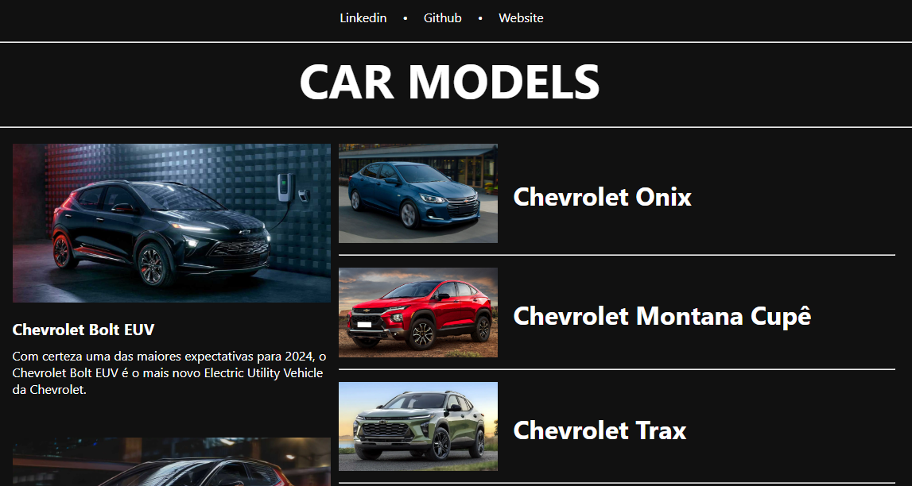
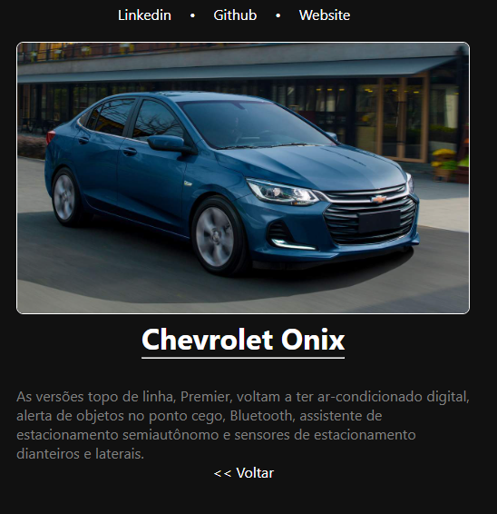

<h1 align="center"> CarModels Blog </h1>

Site feito no angular como parte de uma desafio da Dio Santander.  

  <a href="#-tecnologias">Tecnologias</a>&nbsp;&nbsp;&nbsp;|&nbsp;&nbsp;&nbsp;
  <a href="#-projeto">Projeto</a>&nbsp;&nbsp;&nbsp;|&nbsp;&nbsp;&nbsp;
  <a href="#-layout">Layout</a>&nbsp;&nbsp;&nbsp;|&nbsp;&nbsp;&nbsp;

 

  

## 🚀 Tecnologias

Esse projeto foi desenvolvido com as seguintes tecnologias:

- HTML e CSS
- Typescript
- Git e Github

## 💻 Projeto

Site criado em Angular com sistema de rotas sobre o Id, onde ao clicar no link nos traz a notícia, informação sobre tal assunto.
